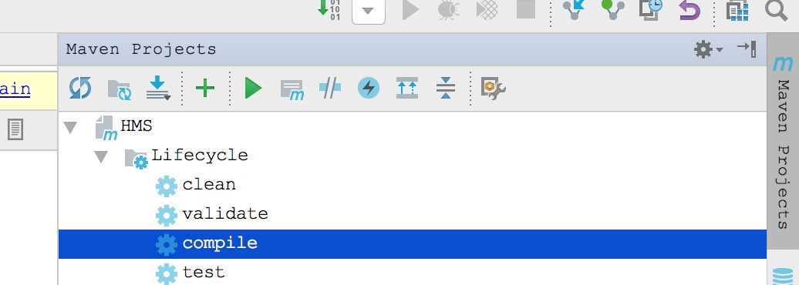
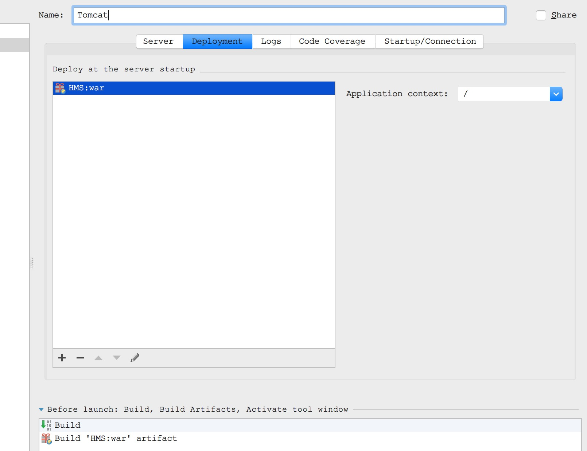

# HMS
---
Semester Project about Hospital Management System
- SpringMVC+Hibernate


 
maybe you need to compile the maven dependency first when you clone the project.

if you use IntelliJ IDEA. 



or use command line  
go to the root dictionary
```
mvn compile
```
if you have any problem,connect with me,or google it.

deploy on tomcat


`remember you need to change your mysql table address and other information`

or you can use command line
```
mvn compile
```
and put the HMS.war in the dictionary of
`tomcat/webapp`